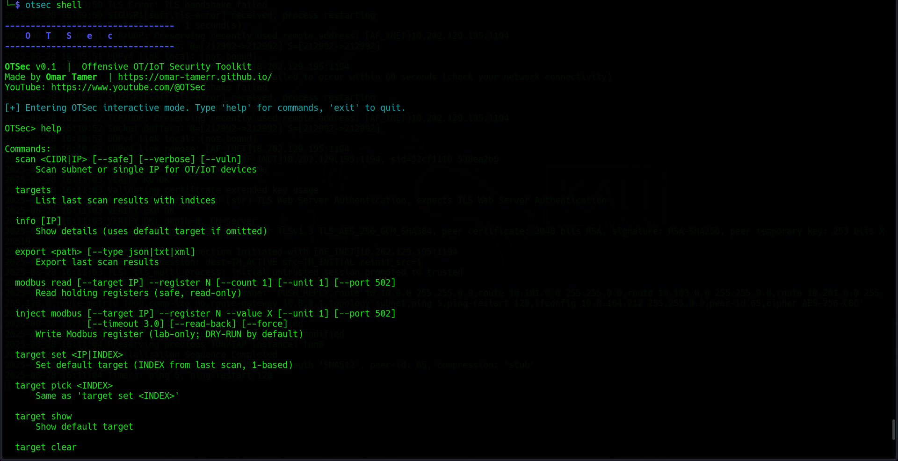
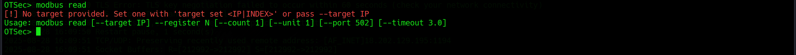
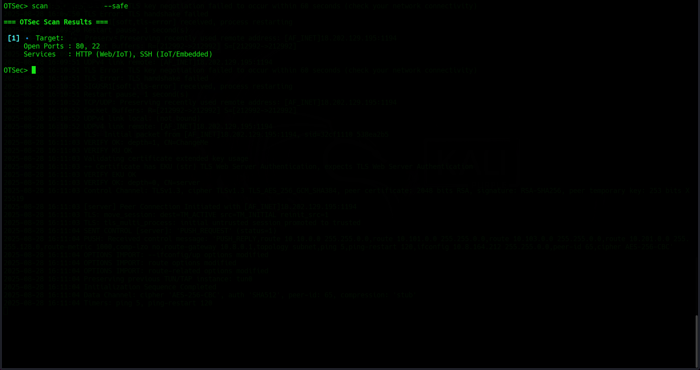
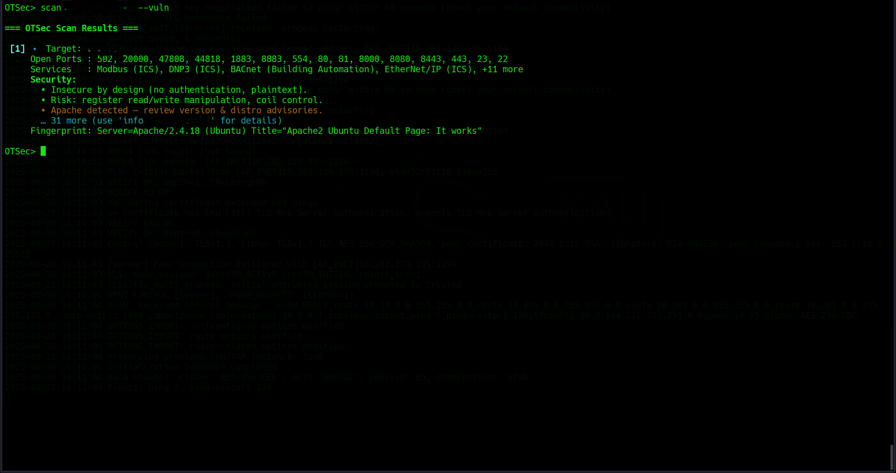
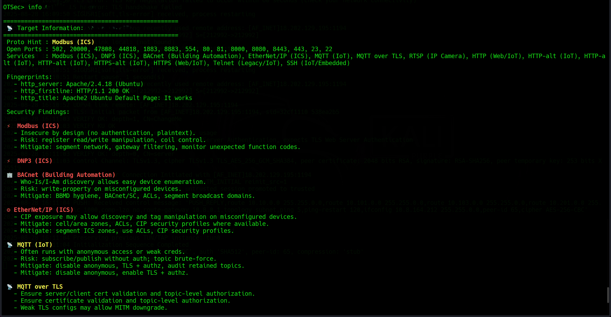

# OTSec — Offensive OT/IoT Security Toolkit

[](https://pypi.org/project/otsec/)
[](https://pypi.org/project/otsec/)
[](LICENSE)
[](https://www.youtube.com/@OTSec)


**OTSec** is a professional-grade toolkit designed for offensive security testing and auditing of OT (Operational Technology) and IoT (Internet of Things) environments. It enables red teamers, security researchers, and industrial penetration testers to interact with and assess real-world OT/ICS/IoT networks in a safe and modular manner.

---

## 🧭 Introduction

Operational Technology systems power critical infrastructure like factories, smart buildings, utilities, and transport systems. Many of these systems rely on insecure-by-design protocols and legacy devices with minimal authentication, leaving them vulnerable to attacks.

**OTSec** is a Python-based toolkit built to bridge the gap between offensive security needs and OT protocol understanding. It gives professionals a modular, scriptable, and extensible interface for scanning, fingerprinting, and manipulating OT/IoT protocols like Modbus, BACnet, MQTT, and more.

OTSec is suitable for:

- Industrial penetration tests
- Smart building assessments
- Red team infrastructure compromise
- Embedded system testing
- OT/IoT protocol experimentation

---

## 🚀 Features

| Feature               | Description                                                                 |
|------------------------|-----------------------------------------------------------------------------|
| Device Discovery       | Perform fast discovery of OT/IoT devices using active fingerprinting        |
| Protocol Detection     | Identify exposed services and protocols (Modbus, MQTT, BACnet, RTSP, etc.) |
| Vulnerability Mapping  | Match banners with known CVEs or risky patterns                            |
| Packet Injection       | Send custom Modbus packets to simulate attacks (lab safe only)             |
| Auth & Config Checks   | Discover default credentials and legacy services                           |
| Interactive Shell      | Use the OTSec command shell for quick commands & module chaining           |
| YAML-Based DB          | Customizable vulnerability and protocol hints DB                           |
| Screenshot Friendly    | Color-coded output and banners for clear visual representation             |

---

## 📦 Installation

### ✅ Easiest Way (Recommended)

You can install OTSec directly from [PyPI](https://pypi.org/project/otsec/):

```bash
pip install otsec 
```


Then simply run:

```bash
otsec or otsec shell
```

---

### 🧪 For Developers (optional)

```bash
git clone https://github.com/omar-tamerr/OTSec
cd OTSec
pip install -r requirements.txt
python3 run_otsec.py shell
```

---

## 🔧 Usage

### Start the Shell

```bash
python3 run_otsec.py shell
```

### Run a Safe Scan

```bash
otsec scan 192.168.1.0/24 --safe
```

### Read Modbus Registers

```bash
otsec modbus-read --host 192.168.1.50 --start 0 --count 5
```

### Inject Modbus Command (lab use only)

```bash
otsec inject --host 192.168.1.50 --function write_single_register --address 1 --value 1234
```

---

## 🖼️ Screenshots (with Description)

### 1. Interactive Shell Launch
  
> Entry point to OTSec’s interactive shell. You can type commands like `scan`, `inject`, or `modbus-read`.

### 2. Help Page
  
> Displays available subcommands with usage hints and descriptions.

### 3. Modbus Read Example
  
> Reads Modbus holding registers from an OT device.

### 4. Modbus Injection (Lab)
  
> Fake data injection for Modbus. Use only in labs/simulations.

### 5. Scan Subnet (Safe Mode)
  
> TCP-based scan showing banners and detected OT protocols.

### 6. Vulnerability Scan Output
  
> Displays matched CVEs/misconfigs based on banners.

### 7. Info Page
  
> Offers protocol-specific notes and attack vectors.

---

## 📁 Directory Structure

```
src/
├── otsec/
│   ├── cli.py            # Command-line entry
│   ├── core/             # Modules for scanning, injecting, etc.
│   ├── data/vulns.yaml   # Vulnerability hints and banner fingerprints
│   └── img/              # Documentation images/screenshots
run_otsec.py              # Single-file entry point
requirements.txt          # Runtime dependencies
```

---

## 📄 License

All rights reserved © Omar Tamer  
This software is provided for educational, ethical, and authorized testing only.

---

## 🌐 Author

- **Name**: Omar Tamer  
- **Website**: [omar-tamerr.github.io](https://omar-tamerr.github.io)  
- **YouTube**: [OTSec Channel](https://www.youtube.com/@OTSec)

